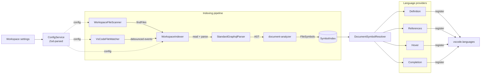

# Architecture

## Philosophy

**Composition > inheritance, interfaces > implementations, explicit > magic.**
Each module has one responsibility, is testable in isolation, and is swappable
through DI without rewriting surrounding code.

## High-level flow



1. **Bootstrap** (`src/main.ts`) resolves `ConfigService`, registers
   infrastructure tokens, attaches `Lifecycle` to the extension context, then
   registers the four language providers and starts the indexer.
2. **Initial scan** — `WorkspaceFileScanner` queries `workspace.findFiles` for
   workspace globs + `node_modules` shared-lib globs in parallel.
3. **Indexing** — for each URI, `WorkspaceIndexer.reindex` reads the file via
   `workspace.fs`, parses with `StandardGraphqlParser`, walks the AST in
   `document-analyzer.ts`, and upserts the resulting `FileSymbols` into
   `SymbolIndex`.
4. **Watch loop** — `VsCodeFileWatcher` emits `FileChangeEvent`s; the
   indexer debounces and re-runs `reindex` per file.
5. **Provider queries** — when VSCode asks for a definition/reference/hover,
   the provider asks `DocumentSymbolResolver` to find the symbol at the
   position (using the indexed file or re-parsing the live unsaved buffer),
   then queries `SymbolIndex` for the answer.

## Domain map

```
src/
├── extension entry
│   ├── index.ts                   activate / deactivate; ESM entry
│   └── main.ts                    DI registration + bootstrap orchestration
├── config/                        Zod schema + ConfigService
├── lifecycle/                     Disposables, shutdown hooks, error handlers
├── logger/                        Pino → VSCode LogOutputChannel
├── parser/                        graphql-js parse() wrapper (tolerant)
├── file-scanner/                  workspace.findFiles abstraction
├── watcher/                       createFileSystemWatcher abstraction
├── indexer/                       SymbolIndex + WorkspaceIndexer + AST analyzer
├── federation/                    built-in Apollo Federation v2 directives
├── providers/                     four VSCode language providers
├── telemetry/                     vscode.env.createTelemetryLogger + noop
├── constants.ts                   IDs, namespaces, log level enum
└── types/                         tiny shared type helpers
```

Each `domain/` follows the same shape:

```
domain/
  base-xxx.ts           abstract class (the public contract)
  standard-xxx.ts       default concrete implementation
  noop-xxx.ts           opt-out implementation (where applicable)
  index.ts              picker function — only public entry
  helpers/              private-to-domain helpers
  types.ts              domain-local types
```

## Key data structures

### `SymbolIndex`

Four maps + a per-file mirror:

| Map                | Key                    | Value                                      |
| ------------------ | ---------------------- | ------------------------------------------ |
| `typeDefinitions`  | type name              | `TypeDefinitionEntry[]` (incl. extensions) |
| `typeReferences`   | type name              | `TypeReferenceEntry[]`                     |
| `fieldDefinitions` | `parentType.fieldName` | `FieldDefinitionEntry[]`                   |
| `fieldReferences`  | `parentType.fieldName` | `FieldReferenceEntry[]`                    |
| `fileSymbols`      | URI string             | `FileSymbols` (used for invalidation)      |

`upsert(FileSymbols)` removes the previous entries for that URI, then
appends. `remove(uri)` cleans up everything tied to a URI in O(symbols-in-file).

### `FileSymbols`

The unit of indexing — produced by `document-analyzer.ts::analyzeDocument`
from a parsed AST + source text. Holds all definitions and references found in
one file with their VSCode `Range`s already computed via `OffsetTable`.

### `OffsetTable`

`positions.ts` — converts graphql-js absolute offsets to VSCode
`Position`/`Range` via a precomputed list of line starts + binary search.
O(log n) per lookup; one allocation per file at parse time.

## Provider behaviour

| Provider                    | Backing data                                                     | Notes                                                                                                                                                                          |
| --------------------------- | ---------------------------------------------------------------- | ------------------------------------------------------------------------------------------------------------------------------------------------------------------------------ |
| `GraphqlDefinitionProvider` | `SymbolIndex.findTypeDefinitions` / `findFieldDefinitions`       | Returns multiple locations when a type has extensions in several files. VSCode pops the peek list.                                                                             |
| `GraphqlReferencesProvider` | `findTypeReferences` / `findFieldReferences`                     | Respects `context.includeDeclaration`.                                                                                                                                         |
| `GraphqlHoverProvider`      | `findTypeDefinitions` + `FederationRegistry`                     | If the symbol is a federation directive, uses the registry's spec doc; otherwise shows the first definition's signature + description.                                         |
| `GraphqlCompletionProvider` | `SymbolIndex.allTypeNames()` + `FederationRegistry.directives()` | If the line ends with `@`, returns directives. Otherwise type names. Context-awareness is intentionally minimal for now (see [federation.md](./federation.md) for follow-ups). |

## Lifecycle

`Lifecycle.attach(context)` stores the extension context and pushes any
disposables registered before activation into `context.subscriptions`.
After that, `lifecycle.register(disposable)` pushes directly into
`context.subscriptions` so VSCode disposes them on deactivate. We do **not**
maintain a parallel disposable list — VSCode is the source of truth.

`onShutdown(fn)` queues a coroutine that runs in reverse on `deactivate`.
Useful for flushing logs/telemetry; not used for VSCode resources.

## Why this shape

- **In-process providers, not LSP.** Single editor (VSCode), no need for the
  protocol overhead. Cheaper memory, faster startup. If we ever target
  Neovim/Helix, the indexer + analyzer move unchanged into an LSP server.
- **Symbol index, not schema.** The federated subgraph is intentionally
  incomplete — half the types live in other repos. Trying to build a full
  schema is wrong. We resolve symbols across files, not types across a graph.
- **VSCode workspace API for FS.** Free integration with `files.exclude`,
  `.gitignore`, multi-root workspaces, and remote development (the API
  abstracts over WSL / SSH / Codespaces). No second indexing engine.
